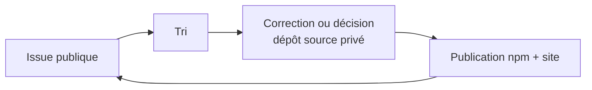

# Contribuer à SIA UI

Merci de vouloir contribuer. Le code source principal de SIA UI est privé pour
le moment; ce dépôt public est le point d'entrée pour les retours utilisateurs.

## Ce que tu peux faire ici

- Signaler un bug rencontré avec un paquet npm ou un composant copié par la CLI.
- Demander un composant, une variante ou un comportement.
- Corriger ou clarifier une page de documentation publiée.
- Poser une question d'usage.

## Ce qui se passe ensuite

Une contribution code directe demande une invitation au dépôt source privé. Une
issue publique suffit pour les bugs, demandes, captures et retours de
documentation.

## Bien choisir le gabarit

- **Anomalie** : quelque chose ne se comporte pas comme annoncé.
- **Composant ou variante** : un besoin revient dans plusieurs projets.
- **Documentation** : une page, un exemple ou un lien pose problème.

